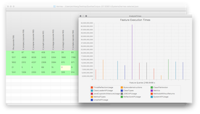

# Hermes - Building and Evaluating Test Corpora

## Overview
Hermes enables you to evaluate a given set of Java (bytecode) projects to comprehend their basic properties and to select those projects that have interesting, distinguishing factors when evaluating and testing your static analysis. 

For example, when you want to test that your analysis is able to handle all types of bytecode instructions, then you should take a close look at the results of the respective query (`BytecodeInstructions`) which reports the usage of Java bytecode instructions for a given project. Additionally, Hermes can automatically select projects for you such that at all instructions are guaranteed to be in the final corpus and that the overall code base of the selected projects is minimal w.r.t. the overall number of methods. This minimal corpus can be computed once all queries are evaluated. To start the computation go to `File` &rightarrow; `Compute Projects for Corpus`.

## Developing Queries
A query is basically a mapping between some feature and those elements of a project that implement/provide/have the respective feature. For example, a feature could be the kind of type (*interface*, *class*, *enum*, *annotation*) which is defined by a specific class file. The query would then analyze all class files of the project and assign each class file to its respective category. In the context of Hermes, we would consider the query as simultaneously deriving multiple features.

All queries in Hermes have to inherit from `org.opalj.hermes.FeatureQuery` and have to implement the two methods: `featureIDs` and `apply` as seen in the example blow.

    package org.opalj
    package hermes
    package queries

    import org.opalj.br.analyses.Project

    object MyQuery extends FeatureQuery {

        override val featureIDs: List[String] = { ??? }

        override def apply[S](
            projectConfiguration: ProjectConfiguration,
            project:              Project[S],
            rawClassFiles:        Traversable[(da.ClassFile, S)]
        ): TraversableOnce[Feature[S]] = {
            ???
    }   }

Next, we will discuss a complete query which finds *native* methods.

    package org.opalj
    package hermes
    package queries

    import org.opalj.br.analyses.Project

    object NativeMethods extends FeatureQuery {

        // The list returns the unique names of the derived features - the names will be
        // used in Hermes' UI and in the CVS export to name the columns. It is therefore
        // recommended to use short, but descriptive names.
        // Additionally, it is recommend to capitalize the name as used in titles.
        //
        // The names of the features returned here have to equal the names used by
        // the query itself (the `apply` function below)!
        override val featureIDs: List[String] = List("Native Methods")

        override def apply[S](
            projectConfiguration: ProjectConfiguration,
            project:              Project[S],
            rawClassFiles:        Traversable[(da.ClassFile, S)]
        ): TraversableOnce[Feature[S]] = {

            // To store the location information; i.e., to store the native methods,
            // we create a new empty LocationsContainer.
            // Using a LocationsContainer for storing locations is highly recommended,
            // because it automatically takes care of limiting the overall number of
            // locations to a pre-configured value. I.e., we don't have to worry about
            // creating too many locations and filling up the memory.
            val nativeMethods = new LocationsContainer[S]

            for {
                // Let's iterate over all class files belonging to the project.
                (classFile, source) ← project.projectClassFilesWithSources

                // It is highly recommended to regularly check if the query should be aborted;
                // if so, the reported (intermediate/partial) results will always be thrown away.
                if !isInterrupted()

                // Locations are immutable and hierarchically organized and therefore it
                // is generally meaningful to always create instances of location information,
                // which may be shared, as soon as possible.
                classLocation = ClassFileLocation(source, classFile)
                m ← classFile.methods
                if m.isNative // basically "the query" 
            } {
                // The current method is native and is added to the set of native methods..
                nativeMethods += MethodLocation(classLocation, m)
            }

            // Finally, we create the feature using the same id as
            // returned by `featureIDs` and the list of native methods.
            Feature[S](featureIDs.head, nativeMethods)
        }
    }

In some cases it might be interesting to also derive general project-wide statistic on the fly. In this case, the results should be stored in the project configuration's `statistics` object. E.g., if you would have computed the average size of the inheritance tree on the fly, you would then store the value in the project's statistics as shown below.

    projectConfiguration.addStatistic("⟨SizeOfInheritanceTree⟩",averageSizeOfInheritanceTree)
    
Here, the string `"⟨SizeOfInheritanceTree⟩"` uses the mathematical notation "⟨⟩" to denote the average.
   
After implementing the query, it is highly recommended to document the query. The documentation should describe the derived feature and should also give at least one example in which context the query is useful. E.g., the above query would help to select trivial programs for which a pure Java based analysis would be sufficient.    

## Executing Queries

After the development of the query it is necessary to register it to make it possible for Hermes to execute it. For that, it is either necessary to add the query to the `application.conf` file, which is part of Hermes, or to create your own config file and add it over there. In both cases the key has to be:

    org.opalj.hermes.queries.registered = [
        {query = org.opalj.hermes.queries.NativeMethods, activate = true }
    ]

The big advantage of registering all queries in the same place is that it is easily possible to order the queries. The recommended ordering is: **descending execution time**. This will reduce the overall runtime.
